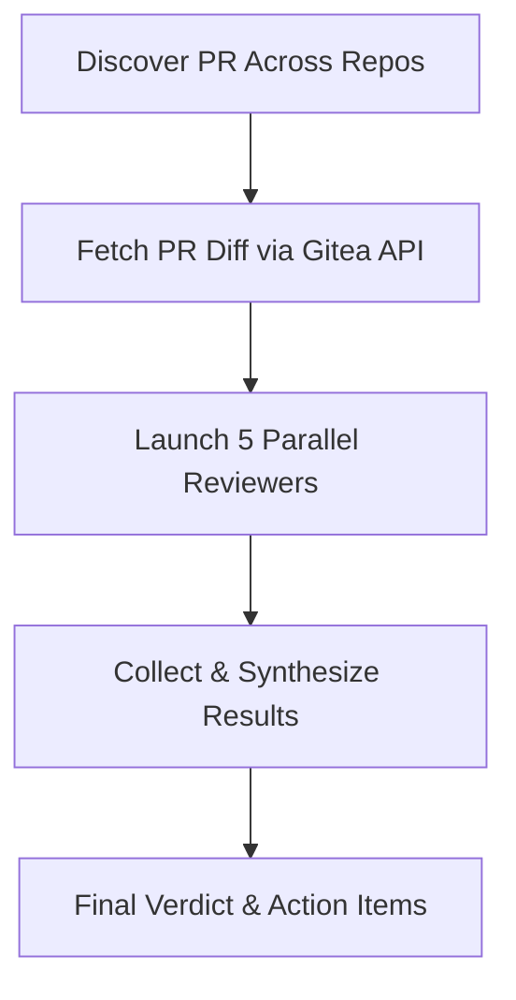

# review-pr - Pull Request Code Review

Perform comprehensive PR reviews using 5 parallel specialized reviewers. Auto-discovers which Gitea repo the PR belongs to.

## Workflow Overview



## Usage

Invoke with a PR number or branch name:
- `[skill:review-pr] 3` - Review PR #3
- `[skill:review-pr] TD-17` - Review by branch name
- `[skill:review-pr]` - Interactive mode (prompts for input)

## Phase 1: Discover PR Across Repos

1. **Get SEARCH_TERM** from arguments or user input
2. **Query all Talgent repos** with open PRs:
   ```bash
   MSYS_NO_PATHCONV=1 powershell -Command '
   $json = & "D:/Code/Talgent/.claude/skills/gitea/Invoke-Gitea.ps1" -Endpoint "/orgs/Talgent/repos?limit=50"
   $repos = $json | ConvertFrom-Json
   $repos | Where-Object { $_.open_pr_counter -gt 0 } | ForEach-Object { $_.name }
   '
   ```

3. **For each repo with open PRs**, list all open PRs:
   ```bash
   MSYS_NO_PATHCONV=1 powershell -File D:/Code/Talgent/.claude/skills/gitea/Invoke-Gitea.ps1 -Endpoint "/repos/Talgent/{REPO_NAME}/pulls?state=open"
   ```

4. **Match PRs against SEARCH_TERM**:
   - If numeric: match by PR `number` field
   - If non-numeric: match by `head.ref` (branch name) using substring match

5. **Handle match results**:
   - **0 matches**: Stop with message
   - **1 match**: Use it
   - **Multiple matches**: Present numbered list for user to choose

## Phase 2: Fetch PR Diff via Gitea API

6. **Fetch the PR diff** using `-RawUrl`:
   ```bash
   MSYS_NO_PATHCONV=1 powershell -File D:/Code/Talgent/.claude/skills/gitea/Invoke-Gitea.ps1 -RawUrl "{DIFF_URL}"
   ```

7. **Display diff stats**:
   ```
   PR #{PR_ID} in {REPO_NAME}: {PR_TITLE}
   Branch: {head.ref} -> {base.ref}
   Diff size: {line count} lines
   ```

## Phase 3: Launch 5 Parallel Reviewers

Use `call_llm` to launch 5 reviewers in parallel with `outputFormat: analysis`:

| Reviewer | Focus | Model |
|----------|-------|-------|
| **Bug & Correctness** | Logical errors, edge cases, null handling | sonnet |
| **Security** | OWASP Top 10, injection, secrets | sonnet |
| **Performance** | N+1 queries, algorithmic complexity | sonnet |
| **Code Quality** | Readability, naming, duplication | sonnet |
| **Architecture** | Design patterns, SOLID, testability | sonnet |

### Agent Prompt Template

```
You are a [ROLE] Reviewer specializing in [FOCUS AREA].

PR: #{PR_ID} in {REPO_NAME}: "{PR_TITLE}"

CRITICAL: Analyze ONLY the diff below. Do NOT use file tools.

--- START OF DIFF ---
{PR_DIFF}
--- END OF DIFF ---

Focus areas:
- [Specific focus items for this reviewer type]

Output format:
## [Reviewer Type] Review

### Critical Issues (Must Fix)
- [Issue] (file:line): Description, Impact, Fix

### High Priority Issues
- [Issue] (file:line): Description, Impact, Fix

### Medium/Low Priority
- [Issue] (file:line): Description, Suggestion

### Positive Observations
- [What was done well]

## Rating
Score: X/10
Justification: [One sentence]
```

## Phase 4: Collect and Synthesize

1. **Collect all 5 reviews** (run in parallel with `call_llm`)
2. **Synthesize into final report**:

```markdown
## PR Review: #{PR_ID} in {REPO_NAME}

**Title:** {PR_TITLE}  
**Branch:** {head.ref} → {base.ref}  
**Diff Size:** {X} lines

---

## Critical Blockers
[Aggregated critical issues from all reviewers]

## Final Verdict
- **Status:** Approve / Approve with suggestions / Request changes
- **Average Rating:** X.X/10

## Review Summary by Category

### 🐛 Bug & Correctness (Rating: X/10)
[Summary of findings]

### 🔒 Security (Rating: X/10)
[Summary of findings]

### ⚡ Performance (Rating: X/10)
[Summary of findings]

### 📋 Code Quality (Rating: X/10)
[Summary of findings]

### 🏗️ Architecture (Rating: X/10)
[Summary of findings]

---

## Prioritized Action List
1. [Highest priority action]
2. [Next priority]
3. [...]
```

## Reviewer Specializations

### Bug & Correctness Reviewer
**Focus:** Logical errors, edge cases, null handling, incorrect assumptions

**Checks:**
- Off-by-one errors, unhandled nulls, missing error handling
- Uninitialized variables, incorrect boolean logic
- Date/time edge cases, floating point issues
- Race conditions, resource leaks

**Output sections:**
- Critical Bugs (crash/data loss)
- High Priority (incorrect behavior)
- Medium/Low Priority (edge cases)
- Positive Observations

### Security Reviewer
**Focus:** OWASP Top 10, injection attacks, secrets exposure

**Checks:**
- A01-A10 OWASP vulnerabilities
- Hardcoded credentials, API keys
- SQL/NoSQL/command injection
- XSS, authentication bypasses
- Sensitive data in logs/errors

**Output sections:**
- Critical Vulnerabilities (exploitable)
- High Priority Issues (weaknesses)
- Medium/Low Priority (hardening)
- Positive Observations

### Performance Reviewer
**Focus:** N+1 queries, algorithmic complexity, scalability

**Checks:**
- Database: N+1, missing indexes, SELECT *, pagination
- Algorithms: nested loops O(n²), memoization opportunities
- I/O: blocking operations, batched requests
- Memory: leaks, unnecessary cloning
- Scalability: global state, lock contention

**Output sections:**
- Critical Performance Issues
- High Priority Issues
- Medium/Low Priority
- Positive Observations

### Code Quality Reviewer
**Focus:** Readability, naming, duplication, structure

**Checks:**
- Naming: clear, descriptive, conventions
- Duplication: repeated logic, copy-paste
- Structure: function/file length, nesting depth
- Comments: explain WHY not WHAT
- Complexity: cyclomatic, magic numbers

**Output sections:**
- High Priority (readability impact)
- Medium Priority (improvements)
- Low Priority (minor style)
- Positive Observations

### Architecture Reviewer
**Focus:** Design patterns, SOLID, testability, best practices

**Checks:**
- Design patterns appropriateness
- Separation of concerns
- Testability (injectable, pure functions)
- Error handling strategy
- Logging/observability
- SOLID principles adherence

**Output sections:**
- High Priority (architectural violations)
- Medium Priority (improvements)
- Low Priority (recommendations)
- Positive Observations

## Constraints

- If diff > 5000 lines: Ask for user confirmation
- If diff > 3000 lines: Focus only on Critical/High issues
- **CRITICAL**: The SAME diff content must be passed to all 5 reviewers - do not truncate/summarize differently per reviewer
- If truncating diff (any size), you MUST inform user: "⚠️ Review is based on partial diff (first X lines)"
- Each reviewer: max 5-7 findings for large diffs
- Prioritize concrete bugs over style preferences

## Safety Rules

1. **Read-only**: Never modify code during review
2. **Diff-only**: Analyze only provided diff, don't explore files
3. **Prioritize**: Lead with critical/high issues
4. **Be specific**: Include file:line references
5. **Explain risk**: What could go wrong, not just "this is bad"
6. **Suggest fixes**: Concrete code changes, not vague advice
